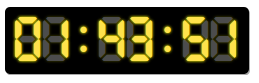

# DigitalClock
I need a small digital clock, a little old-fashioned style to just
drop into various pages in some Rails apps.

The basics are here and I'll probably add to this soon.


## Installation
Add it to your gem file:

```ruby
gem 'digital_clock', github: "chriswnl/digital_clock"
```
Add the css and javascript to your rails assets pipeline:

```javascript
// assets/javascripts/application.js
//
//= require jquery
//= require digital_clock
//

```
```javascript
/*
 * # assets/stylesheets/application.css
 *= require digital_clock
*/
```
## Usage
In a view, you have access to the helper ```digital_clock``` so you can use:

```
<%= digital_clock %>
```
The basic clock was yellow/gold. Other colours are ```:green```, ```:red``` and ```:blue```.
```
<%= digital_clock(:blue) %>
```
If you want additional colours, the CSS is very simple so create them yourself. 

```css
.green {
  text-shadow: 0 0 2px lightgreen !important;
  color: green !important;
}
```
Digits are created using the Digital Dismay font and so are scalable. Just wrap them in a ```div``` or something like ```h1```.


## License
The gem is available as open source under the terms of the [MIT License](http://opensource.org/licenses/MIT).

Digital Dismay has [this licence/usage agreement](digital_dismay_licence.txt).
